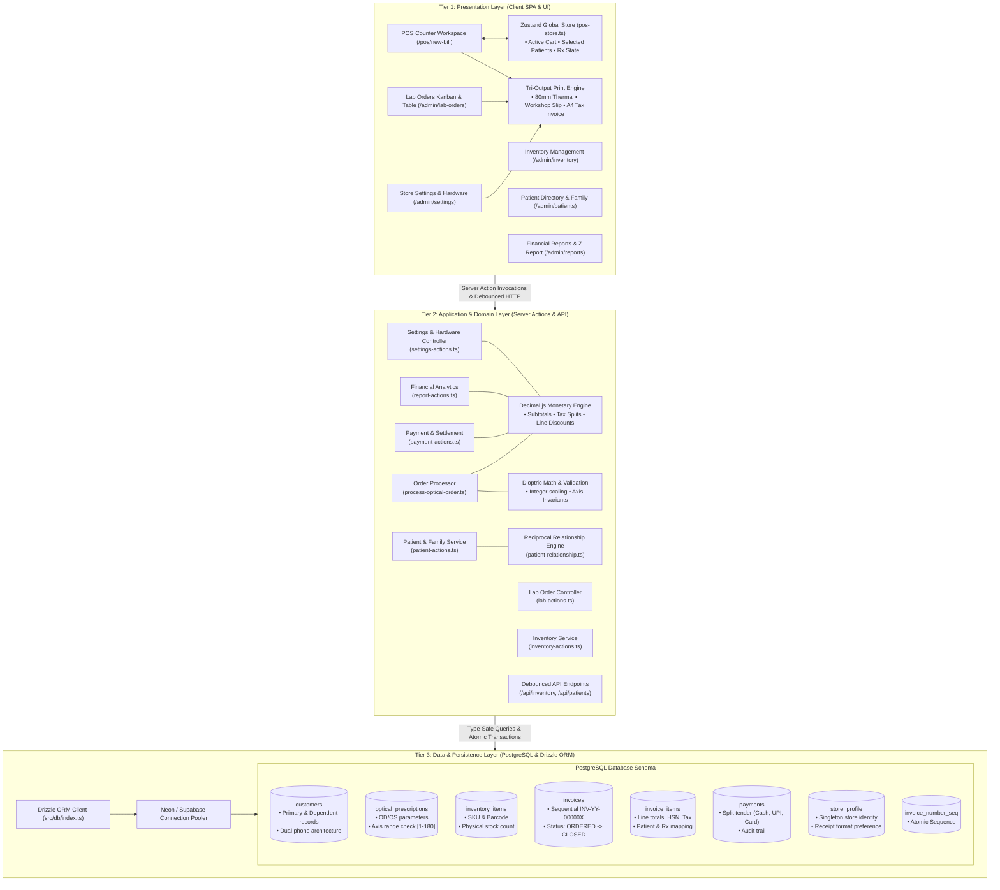
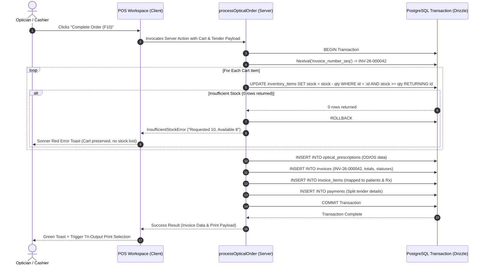
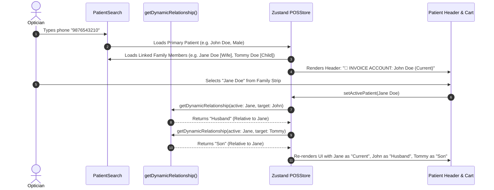

# OptixOS — Architecture, PRD & Master System Roadmap

## 1. Executive Summary & Architectural Evolution

**OptixOS** is a domain-engineered, high-performance retail Optical Point-of-Sale (POS) and Practice Management System. It was designed from the ground up to solve the unique operational and clinical challenges of retail optical practices:
- Disparate clinical eye measurements (**OD/OS dioptres, axes, additions, and PD**) that must seamlessly bind to retail frame chassis and ophthalmic lenses.
- Complex multi-generational family billing structures where multiple relatives order spectacles simultaneously under a single payer account.
- High-velocity point-of-sale checkout requiring sub-150ms product lookups, zero floating-point financial errors, and atomic row-level concurrency to prevent overselling.
- Strict operational segregation between customer-facing financial documents (tax invoices, thermal receipts) and fabrication-floor documents (workshop lab slips) with strict financial redaction.

### The Architectural Transition: Evolution to a Robust 3-Tier Architecture

Early POS implementations often couple presentation logic directly to ad-hoc database queries or monolithic client-side operations. OptixOS strictly implements a decoupled **3-Tier Architecture**:

1. **Tier 1: Presentation Layer (Client Components & Global State)**:
   - Built on Next.js 15 App Router client components (`'use client'`).
   - Rich interactive widgets (Cart, Prescription Grid, Spectacle Builder Wizard, Product Dispatcher, Kanban Board, Reports Ledger, Settings & Print Engine).
   - Global reactive state orchestrated by **Zustand** with SPA-level persistence across route transitions.
   - 100% WCAG 2.1 AA accessible UI with semantic contrast, programmatic label associations, and fluid full-width responsive layouts.

2. **Tier 2: Business & Application Layer (Domain Services & Server Actions)**:
   - Type-safe Next.js Server Actions (`'use server'`) acting as isolated domain controllers.
   - Enforces business rules: integer-scaled dioptric interval validation, reciprocal family perspective resolution, 100% `decimal.js` monetary calculations, and role-based data masking.
   - Manages complex multi-step workflows such as atomic checkout transactions, workshop state transitions, balance settlements, and store profile mutations.

3. **Tier 3: Data & Persistence Layer (PostgreSQL / Neon / Supabase + Drizzle ORM)**:
   - Serverless PostgreSQL database accessed via connection poolers.
   - Fully typed schema governed by **Drizzle ORM** with database-level sequence generators, check constraints, foreign keys, compound indexes, and singleton store profile configuration.
   - Atomic row-level updates (`RETURNING id`) guaranteeing zero overselling and immediate transaction rollbacks upon stock exhaustion.

---

## 2. High-Level System Architecture



---

## 3. Detailed 3-Tier Decomposition

### 3.1 Tier 1: Presentation Layer

The presentation layer runs primarily in the client browser as a Next.js Single Page Application (SPA), orchestrated with fluid full-width responsive layouts and persistent top navigation.

#### Component Hierarchy & Modular Units
- **POS Workspace (`src/components/pos/pos-view.tsx`)**:
  - Split-pane interface providing customer selection, family strip, dynamic cart table, OD/OS clinical prescription grid, and split-tender payment panel.
  - Hotkey listener handling keyboard ergonomics (`F1` new bill, `F2` product catalog, `F3` search focus, `F10` settlement).
- **Clinical Prescription Matrix (`src/components/pos/prescription-grid.tsx`)**:
  - Independent OD (Right Eye) and OS (Left Eye) input matrix with rapid keyboard steppers (`+` / `-` 0.25 D increments), Axis controls (1°–180°), Addition, and Pupillary Distance (PD).
  - Multi-tab support for switching between family members assigned to the order.
  - Historical Rx switcher with 1-click prescription re-application.
- **Spectacle Pair Builder Wizard (`src/components/pos/spectacle-wizard-modal.tsx`)**:
  - 3-step modal guiding opticians through Frame Confirmation, Lens Type/Index/Coating selection, and Optical Power Binding.
- **Product Category Dispatcher (`src/components/pos/add-product-modal.tsx`)**:
  - Dedicated categorization covering Complete Spectacles, Lens Only (with ₹0.00 frame chassis), Sunglasses, Contact Lenses, Lens Care Solutions, and Accessories.
- **Lab Orders Kanban & Table (`src/components/admin/lab-orders-view.tsx`)**:
  - Visual status pipeline columns (`ORDERED` -> `SENT_TO_LAB` -> `IN_FITTING` -> `READY_FOR_COLLECTION` -> `DELIVERED_AND_CLOSED`).
  - Workshop job slip generator with strict financial redaction.
  - Delivery and balance collection modal (`settle-balance-modal.tsx`).
- **Reports & Analytics View (`src/components/admin/reports-view.tsx`)**:
  - Daily Z-Report generation, custom date range filtering, payment mode splits (Cash, UPI, Card), and real-time revenue ledger.
- **Store Settings & Print Engine Configuration (`src/components/admin/settings-view.tsx`)**:
  - Tabbed administrative interface (`/admin/settings`) to manage store legal identity, GSTIN, phone, physical dispensary address, and default GST rate.
  - Print Configuration cards allowing toggle between **Thermal 80mm Roll** and **Laser A4 Tax Invoice**.
- **Dedicated Hardware Print Engine (`src/components/print/`)**:
  - `ThermalReceipt.tsx`: 80mm ESC/POS roll format with monospace typography and tax breakdowns.
  - `A4TaxInvoice.tsx`: Formal corporate laser tax invoice with HSN tables and signature block.
  - `WorkshopLabSlip.tsx`: Dedicated optical fabrication ticket with OD/OS dioptre grid and financial redactions.

#### Global State Management (Zustand)
- State file: [`src/store/pos-store.ts`](file:///f:/hobby-projects/optical-pos/src/store/pos-store.ts)
- Retains volatile order state during route navigation (`/pos/new-bill` ↔ `/admin/inventory` ↔ `/admin/patients`):
  - `cart`: Array of line items with patient assignment, discount, tax rate, and optical specs.
  - `selectedPatient`: Currently active patient on the order.
  - `activeRx`: Current clinical prescription matrix values.
  - `primaryPatient` & `familyMembers`: Loaded family group cluster.
  - `invoiceAccount`: Explicitly designated billing payer.
  - `printOrderData`: Formatted data payload cached for immediate printing.

---

### 3.2 Tier 2: Business & Application Layer

The application layer contains all domain rules, validation logic, and transaction coordinators. It executes on the server runtime via Next.js Server Actions and Route Handlers.

#### 1. Atomic Order Processor (`src/actions/process-optical-order.ts`)
- Encapsulates the entire checkout transaction inside a PostgreSQL database transaction (`db.transaction`).
- Steps executed atomically:
  1. **Customer Resolution:** Ensures the payer and line-item patients exist and are linked.
  2. **Prescription Saving:** Persists any new clinical dioptre values entered during checkout into `optical_prescriptions`.
  3. **Sequential Invoice Generation:** Calls `invoice_number_seq` to generate a gap-free invoice identifier (format: `INV-YY-00000X`).
  4. **Atomic Inventory Decrement:** Executes row-level conditional decrement for every stocked item.
  5. **Invoice & Line Items Persistence:** Inserts the master invoice and individual items with HSN codes and GST splits.
  6. **Payment Recording:** Logs split payments across Cash, UPI, and Card.
  7. **Rollback Guard:** If any step fails (e.g. stock exhausted), the transaction rolls back completely and throws a structured domain error.

#### 2. Dynamic Reciprocal Family Billing Engine (`src/lib/patient-relationship.ts`)
- Eliminates ambiguous `"Self"` labels across the application.
- Given an active/selected customer and a target family member, dynamically calculates the reciprocal relationship based on family topology and gender:
  $$\text{Relationship}(A \to B) = \text{Reciprocal}(\text{BaseRelation}(B), \text{Gender}(A))$$
- Supports full multi-generational mappings: Parent/Child, Spousal (Husband/Wife), Sibling (Brother/Sister), and Extended (Uncle/Aunt, Nephew/Niece).

#### 3. Lab Order Workshop Lifecycle (`src/actions/lab-actions.ts`)
- Manages the optical laboratory workflow:
  $$\text{ORDERED} \longrightarrow \text{SENT\_TO\_LAB} \longrightarrow \text{IN\_FITTING} \longrightarrow \text{READY\_FOR\_COLLECTION} \longrightarrow \text{DELIVERED\_AND\_CLOSED}$$
- Extracts and flattens patient prescription matrices across all order items for the workshop fabrication team.

#### 4. Balance Settlement Service (`src/actions/payment-actions.ts`)
- Handles balance collection upon spectacle collection.
- Uses `decimal.js` to compute `newBalance = balanceDue - amount`.
- Automatically transitions the order status to `DELIVERED_AND_CLOSED` once the balance due reaches zero.

#### 5. Store Settings & Print Engine Service (`src/actions/settings-actions.ts`)
- Singleton `getStoreProfile()` retrieval with automatic default bootstrap.
- Zod-validated `updateStoreProfile()` with decimal tax rate validation and multi-path cache revalidation.
- `getInvoicePrintData(invoiceId)` delivering pre-computed invoice and optical dioptre structures for thermal, laser, and workshop printing.

#### 6. Financial Accuracy & Arbitrary-Precision Math
- Native JavaScript IEEE-754 arithmetic is strictly prohibited for monetary amounts.
- All monetary operations utilize `decimal.js`:
  ```typescript
  const taxable = new Decimal(item.unitPrice)
    .minus(new Decimal(item.discountPerUnit))
    .times(item.quantity);
  const taxAmount = taxable.times(new Decimal(item.taxRate)).dividedBy(100);
  const lineTotal = taxable.plus(taxAmount);
  ```

#### 7. IEEE-754 Safe Dioptric Interval Refinement
- Validates dioptric increments in 0.25 D steps using integer scaling:
  ```typescript
  const isQuarterStep = (val: number): boolean => {
    return Math.round(val * 100) % 25 === 0;
  };
  ```
- Enforces the optical invariant: `CYL != 0` requires `AXIS` in range `[1, 180]`.

---

### 3.3 Tier 3: Data & Persistence Layer

The persistence layer is built on PostgreSQL (hosted via Neon Serverless Postgres with connection pooling or Supabase-compatible PostgreSQL) and configured with Drizzle ORM.

#### Schema Definitions & Constraints (`src/db/schema.ts`)
- **`customers`**: Stores patient profile, dual-phone fields (own mobile and linked family mobile), advance balance, and hierarchical `primary_customer_id` pointer.
- **`optical_prescriptions`**: Stores discrete OD and OS parameters (`numeric(5,2)` for SPH/CYL, `integer` for Axis with `CHECK (axis >= 1 AND axis <= 180)`), ADD, and PD.
- **`inventory_items`**: Manages product catalog, optical lens classifications, stock counts, cost prices (masked at query level), selling prices, and HSN codes.
- **`invoices`**: Records financial totals, GST breakdowns (CGST, SGST, IGST), advance paid, balance due, promised delivery date, and order status enum.
- **`invoice_items`**: Line items linking inventory items, patients, prescriptions, fitting notes, and "Customer's Own Frame" flags.
- **`payments`**: Payment records tracking split modes (`CASH`, `UPI`, `CARD`, `CREDIT`) and transaction references.
- **`store_profile`**: Singleton configuration table storing store name, GSTIN, phone, address, default tax rate, and receipt type enum.
- **`invoice_number_seq`**: PostgreSQL sequence guaranteeing continuous, gap-free invoice numbering.

#### Concurrency & Atomic Decrement
```sql
UPDATE inventory_items
SET stock_quantity = stock_quantity - :qty
WHERE id = :id AND stock_quantity >= :qty
RETURNING id;
```
If physical stock is less than `:qty`, 0 rows are returned, triggering an immediate exception and rolling back the outer transaction.

---

## 4. Key Workflows & Sequence Diagrams

### 4.1 Atomic Order Processing & Concurrency Lock



### 4.2 Dynamic Reciprocal Family Perspective Flow



---

## 5. Security, RBAC & Redaction Architecture

1. **Wholesale Cost Price Masking at Database Projection Level**:
   - The wholesale cost (`cost_price`) of inventory items represents sensitive business intelligence.
   - Non-administrative database queries project only public fields (`sku`, `brand`, `model`, `selling_price`, `stock_quantity`, `tax_rate`).
   - `cost_price` is never included in client JavaScript bundles or hidden using CSS; it is omitted at the SQL `SELECT` projection level.

2. **Workshop Fabrication Slip Redaction**:
   - Optical technicians in the fitting workshop require lens parameters, chassis measurements, and dioptres, but must not see financial data.
   - The workshop slip rendering component entirely omits line totals, item prices, advance payments, and customer balance due from the DOM tree.
   - Enforced further via `@media print` CSS utility rules (`body.print-mode-workshop .financial-data { display: none !important; }`).

3. **Immutable Invoice Integrity**:
   - Once an order transitions to `DELIVERED_AND_CLOSED`, it cannot be modified via standard POS mutations.
   - Financial adjustments require an administrative credit note or audit adjustment action.

---

## 6. Continuous Knowledge Graph (`graphify`) & Quality Assurance

### Continuous Knowledge Graph Integration
As mandated by project engineering standards, OptixOS maintains an automated semantic knowledge graph synced with the codebase:
- Knowledge graph engine: **`graphify`**
- Command: `graphify .` (or `graphify update .`)
- Artifact output: `graphify-out/` (`graph.html`, `graph.json`, `GRAPH_REPORT.md`)
- Captures over 400 structural nodes, 800 semantic edges, and 22 cohesive communities spanning clinical optical management, transactional order processing, database schemas, and analytics.

### Local CI Pipeline
Every modification must pass the local CI verification pipeline before deployment:
```bash
npm run validate
```
This single gatekeeper command executes:
1. `next lint` (ESLint 9 syntax, imports, and accessibility rules)
2. `tsc --noEmit` (Strict TypeScript compiler check with zero `any`)
3. `npm run test:e2e` (Playwright End-to-End browser test suite across all 16 test cases)

Following validation, `graphify .` is executed to synchronize the architectural knowledge graph.

---

## 7. Master Implementation Roadmap (Phases 1 to 13)

| Phase | Module / Capability | Status | Core Deliverables & Technical Scope |
| :---: | :--- | :---: | :--- |
| **Phase 1** | **Core Architecture & Schema Foundations** | ✅ Completed | Serverless PostgreSQL schema (Drizzle ORM), connection pooling, domain entities (`customers`, `optical_prescriptions`, `inventory_items`, `invoices`, `invoice_items`, `payments`), check constraints, gap-free sequences. |
| **Phase 2** | **POS Workspace & Clinical Refraction Matrix** | ✅ Completed | Two-column split-pane POS interface, independent OD/OS matrix, keyboard steppers (`+`/`-`), integer-scaled dioptric interval validation (`Math.round(val * 100) % 25 === 0`), Axis check rule, historical Rx selector. |
| **Phase 3** | **Dynamic Reciprocal Family Billing Engine** | ✅ Completed | Elimination of ambiguous `"Self"` labels (`getDynamicRelationship`), gender-aware reciprocal family mapping, conditional `👑 INVOICE ACCOUNT` selector, multi-generational dependent grouping. |
| **Phase 4** | **Spectacle Wizard & Category Dispatcher [F2]** | ✅ Completed | 3-step Spectacle Pair Builder (Frame Confirmation, Lens Selection, Power Assignment), 6-category product dispatcher (`F2`), Customer's Own Frame (Glazing) mode. |
| **Phase 5** | **Atomic Concurrency & Split-Tender Checkout** | ✅ Completed | Row-level conditional update lock (`UPDATE ... WHERE stock_quantity >= :qty RETURNING id`), zero negative overselling, arbitrary-precision `decimal.js` monetary calculations, 5%/18% GST splits, Cash/UPI/Card split-tender settlement. |
| **Phase 6** | **Tri-Output Print Engineering** | ✅ Completed | Dedicated hardware print drivers: 80mm thermal receipt (`body.print-mode-thermal`), workshop fabrication slip (`body.print-mode-workshop`) with strict financial redaction, A4 executive laser tax invoice (`body.print-mode-a4`). |
| **Phase 7** | **Lab Orders & Workshop Pipeline** | ✅ Completed | Workshop state machine (`ORDERED` -> `SENT_TO_LAB` -> `IN_FITTING` -> `READY_FOR_COLLECTION`), interactive 4-column Kanban board, sortable/searchable Table view, workshop job slip generator. |
| **Phase 8** | **Order Settlement & Final Delivery** | ✅ Completed | Atomic `collectBalance` action inside `db.transaction`, `SettleBalanceModal` with WCAG AA contrast, balance collection upon customer pickup, automatic transition to `DELIVERED_AND_CLOSED`, e2e verification. |
| **Phase 9** | **Store Settings & Print Engine Customization** | ✅ Completed | Singleton `store_profile` PostgreSQL table & enum, Server Actions (`getStoreProfile`, `updateStoreProfile`, `getInvoicePrintData`), `/admin/settings` page with General Profile & Print Configuration tabs, modular print components (`ThermalReceipt`, `A4TaxInvoice`, `WorkshopLabSlip`), POS & Patient history print buttons, and dedicated Playwright E2E suite (`settings-print.spec.ts`). |
| **Phase 10** | **Workshop Glazing & Lens Edging Integration** | 🟡 Next Up | Optical lens edging tickets, lab batch dispatch, outside lab job tracking, automated SMS/WhatsApp alerts upon transition to `READY_FOR_COLLECTION`. |
| **Phase 11** | **Multi-Branch Inventory & Stock Audits** | ⚪ Roadmap | Inter-branch stock transfer orders, in-transit stock ledger, physical stock discrepancy adjustments, barcode scanner batch intake, automated reorder threshold triggers. |
| **Phase 12** | **Clinical Appointments & Patient Recalls** | ⚪ Roadmap | Optometrist appointment scheduling calendar, exam room slot booking, annual eye examination recall reminders via WhatsApp/SMS, expanded clinical notes & visual acuity charts. |
| **Phase 13** | **Multi-Tenant SaaS Hardening & Enterprise ERP** | ⚪ Roadmap | Row-Level Security (RLS) policies for multi-tenant optical chains, consolidated corporate tax reporting, Indian GST 2.0 inverted duty credit reconciliation (HSN 9001 vs 9003/9004), immutable audit log stream. |