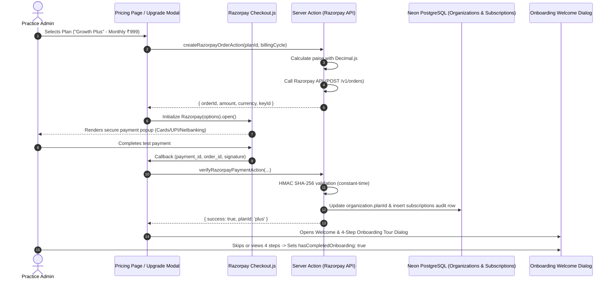

# Implementation Plan: Razorpay SaaS Subscription & Payment System

- **Feature ID**: `025-razorpay-saas-subscription`
- **Target Date**: `Phase 25`

---

## 1. Architectural Blueprint

---

## 2. Technical Stack & Dependencies
- **Razorpay REST API**: Direct server-to-server calls with HTTP Basic Auth (`RAZORPAY_KEY_ID:RAZORPAY_KEY_SECRET`). Zero heavy unneeded npm packages.
- **Frontend SDK**: Dynamic script loading of `https://checkout.razorpay.com/v1/checkout.js`.
- **Database**: Drizzle ORM schema additions (`organizations` plan fields + `subscriptions` audit table).
- **Security**: Node.js `crypto` HMAC SHA-256 signature verification with `timingSafeEqual`.
- **Math**: `decimal.js` for financial calculations in rupees and paise.

---

## 3. Phased Implementation Sequence

### Phase 1: Environment & Secrets Configuration
- Configure `.env.local` and `.env.example` with Razorpay test keys (`NEXT_PUBLIC_RAZORPAY_KEY_ID`, `RAZORPAY_KEY_ID`, `RAZORPAY_KEY_SECRET`, `RAZORPAY_WEBHOOK_SECRET`).

### Phase 2: Database Schema & Subscriptions Table
- Update `organizations` table in `src/db/schema.ts` with `planId`, `subscriptionStatus`, `subscriptionPeriod`, `subscriptionEndsAt`, `hasCompletedOnboarding`.
- Create `subscriptions` audit table in `src/db/schema.ts`.
- Push schema changes to Neon database (`npx drizzle-kit push`).

### Phase 3: Razorpay Server Library & Actions
- Create `src/lib/razorpay.ts` (API client for Orders, Payment Links, and Signature verification).
- Create/update `src/actions/subscription-actions.ts`:
  - `createRazorpaySubscriptionOrderAction`
  - `verifyRazorpayPaymentAction`
  - `handlePaymentFailureAction`
  - `completeOnboardingAction`
  - `getOrganizationSubscriptionStatusAction`

### Phase 4: Feature Gating & Entitlements
- Create `src/lib/feature-gate.ts` with permission matrix (Branch count, invoice limits, workshop lab, multi-branch analytics).
- Build `<PlanUpgradeGate>` and `<UpgradeModal>` components.

### Phase 5: Client Checkout Integration & Pricing UI
- Build `useRazorpayCheckout` hook / utility.
- Upgrade `src/app/pricing/page.tsx` with live checkout triggers, loading spinners, and failure recovery.
- Add `<SubscriberOnboardingModal>` (Lovable 4-step guided tour with skip option).

### Phase 6: Webhook Integration (Eventual Consistency)
- Create `/api/webhooks/razorpay/route.ts` with HMAC signature validation for `payment.captured`, `order.paid`, `payment.failed`.

### Phase 7: Verification & Quality Gate
- `npm run check` (TypeScript + ESLint).
- `npm run audit:security` (Security debt scan).
- `graphify update .` (Knowledge graph refresh).
